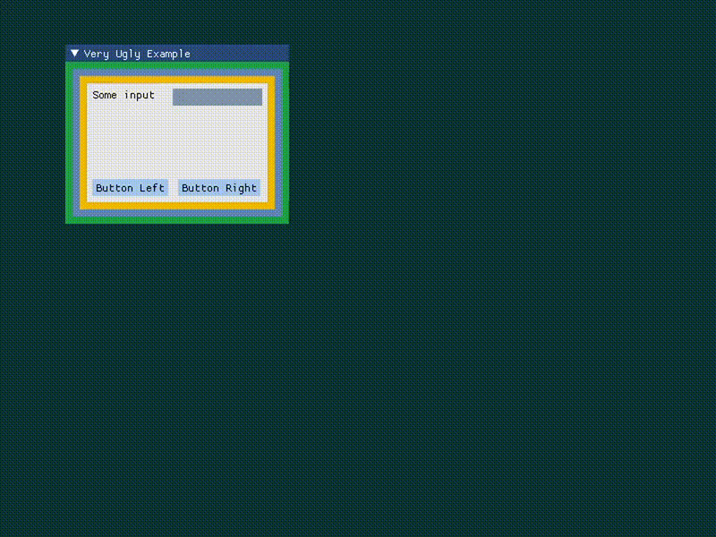

# Simple9SliceScale
This is a simple implementation of [9-slice scaling](https://en.wikipedia.org/wiki/9-slice_scaling) using OpenGL. The rendered textures can be used as background images for 2D scalable rectangular shapes.

Feel free modify and use it in your project.

## Build
Use [CMake](https://cmake.org/download/) to generate project / build files. All dependencies are handled in the *CMakeLists.txt* files.
Run the following command in the project directory (where the CMakeLists.txt is located):
```bash
cmake -B build
```

## ImGui example window:

